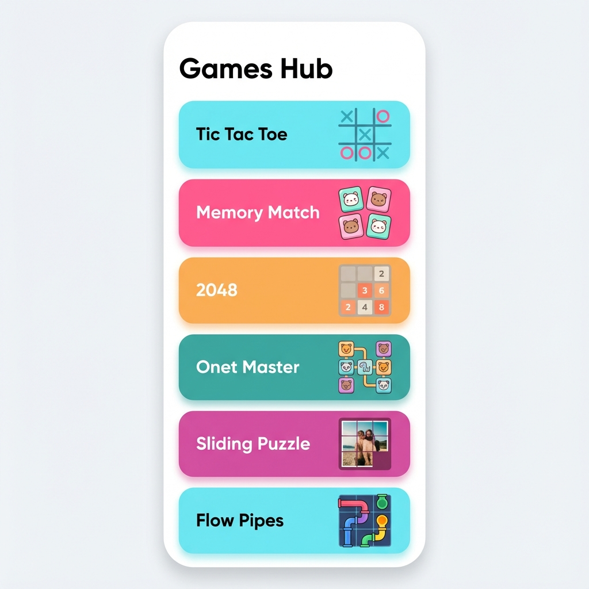
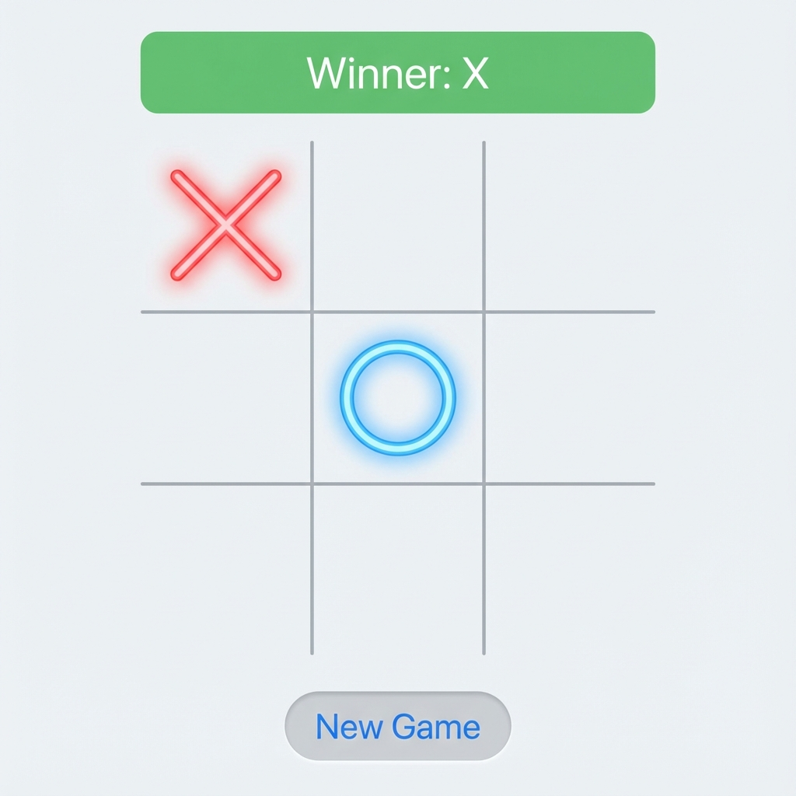
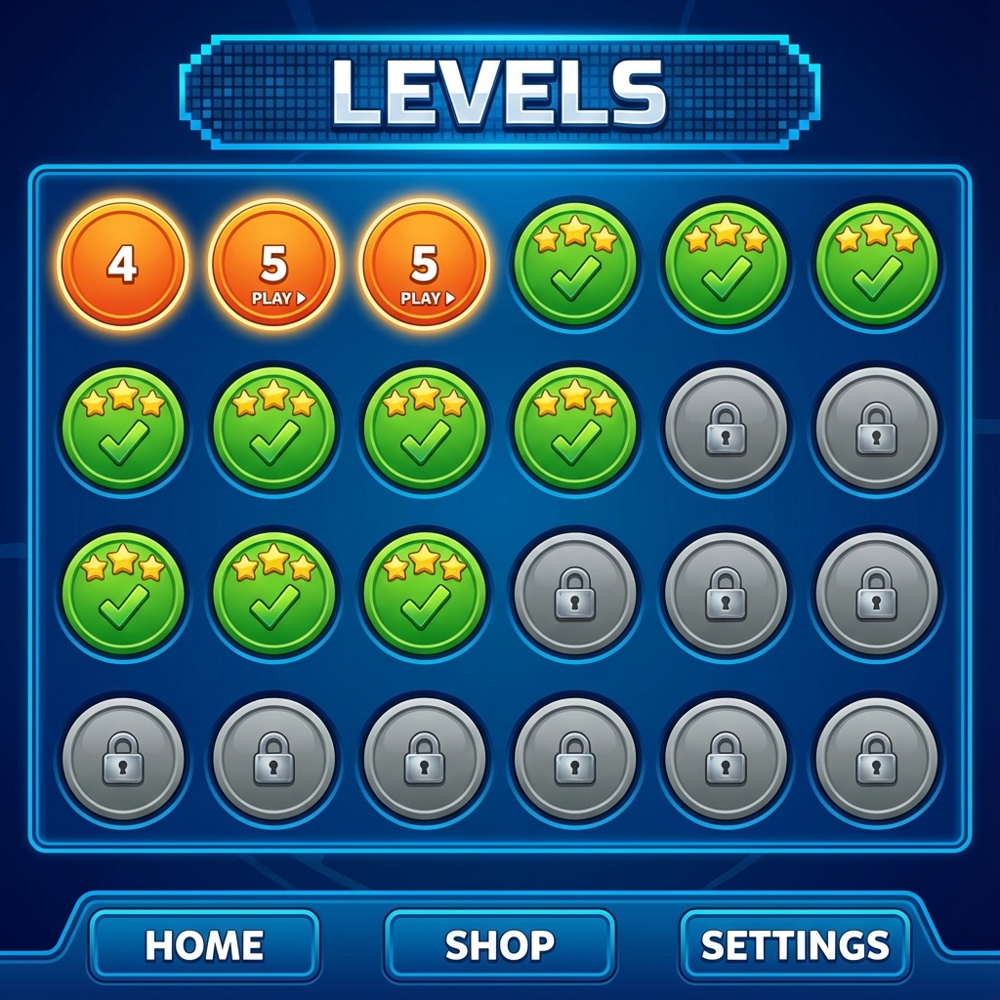
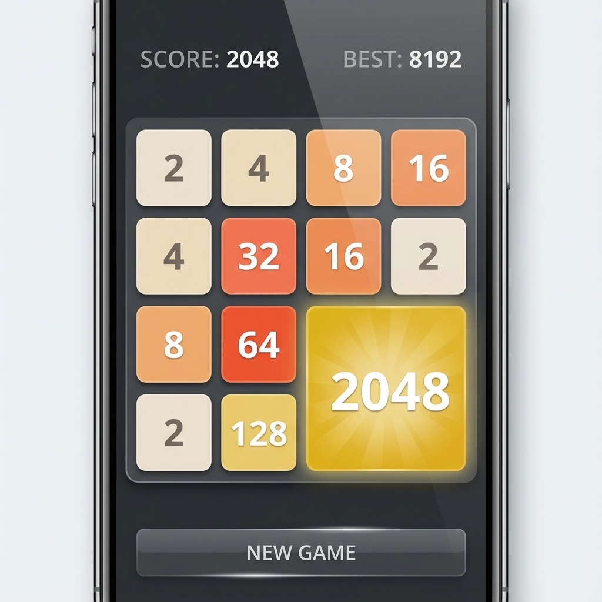
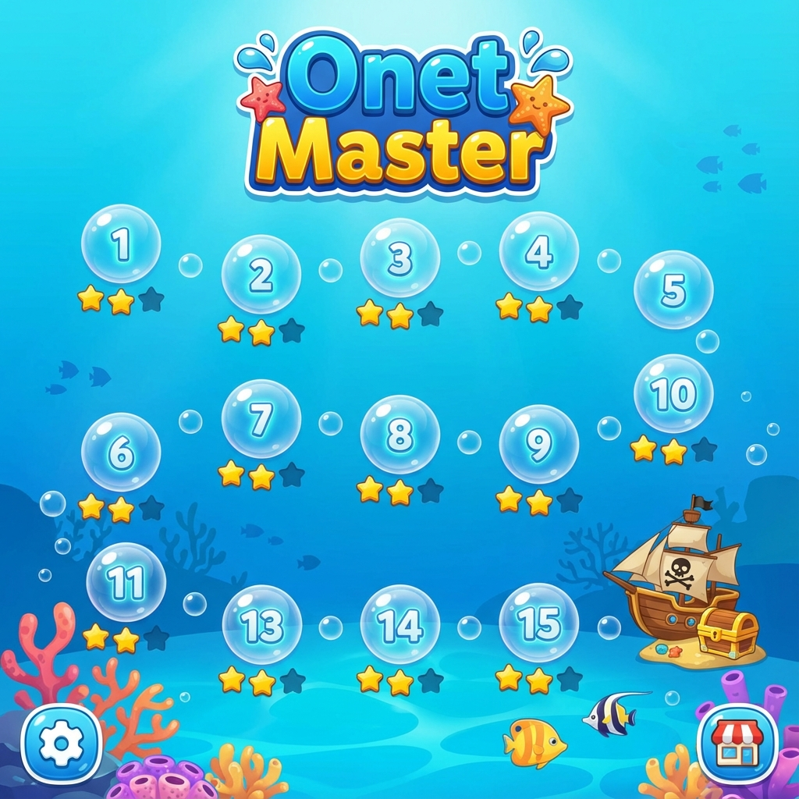
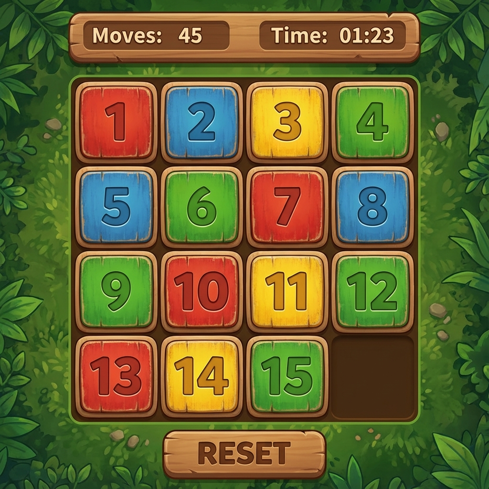

# Mini Games Hub & Reviewer 🎮🎬

A premium **React Native (Expo)** application that combines a robust **Mini Games Hub** with a professional **Movie/Web Series Review** system. Built with a focus on polished UI/UX, smooth animations, and persistent offline progression.

---

## 🚀 The Games Hub

Experience nine classic logic and learning games, all modernized with vibrant visuals and intelligent gameplay.

### 1. Tic Tac Toe ⭕❌
- **Neon Aesthetic**: High-contrast, glowing UI for a modern feel.
- **Winning Logic**: Instant winner detection with animated celebratory banners.
- **Micro-animations**: Satisfying Haptic-like scaling effects on every move.

### 2. Memory Match 🧠
- **Level System**: 21 unlockable levels with persistent progress.
- **Visual Rewards**: Star-rating system (1-3 stars) based on performance.
- **Scaling Difficulty**: Grids grow from 2x2 to complex 8x8 layouts.

### 3. 2048 🔢
- **Smooth Merges**: Custom "pop" animations when tiles combine.
- **High Scores**: Automatically tracks and persists your all-time "BEST" score locally.
- **Interactive UI**: Fluid swipe gestures and high-contrast tile design.

### 4. Onet Master 🀄
- **Intelligent Shuffle**: Automatically reshuffles the board if no moves remain, preventing deadlocks.
- **Aquatic Theme**: Beautiful sea-themed level selection and bubble-style UI.
- **21 Levels**: Progressive difficulty scaling for endless fun.

### 5. Sliding Puzzle 🧩
- **Solvability Guaranteed**: Every puzzle is mathematically checked to ensure it can be solved.
- **Performance Tracking**: Real-time move counter and precision timer.
- **Tactile Design**: Crisp, wood-textured tiles and smooth slide animations.

### 6. Flow Pipes 💧
- **Path-First Logic**: Advanced algorithm guarantees 100% solvable puzzles that fill the entire grid.
- **O(1) Win Check**: Instant validation of path connections and board fill.
- **Vibrant Pipes**: Draw colorful connecting lines without crossing paths.

### 7. Abacus Math 🧮
- **Mental Arithmetic**: Practice math using a digital abacus with realistic bead physics.
- **Multiple Modes**: Addition, subtraction, and multiplication levels.
- **Educational UI**: Designed to mirror traditional learning tools.

### 8. Speak & Learn 🔊
- **Interactive Audio**: Uses **Expo-Speech** for high-quality pronunciation of letters and numbers.
- **Kids-First Design**: Massive typography and high-contrast colors for accessibility.
- **Auto-Play**: Automatically cycles through characters for hands-free learning.

### 9. Shape Tap ✨
- **Saturated UI**: Modern, vibrant colors designed to engage children.
- **Celebrating Success**: Animated confetti and auditory praise on correct taps.
- **Randomized Learning**: Shuffles shapes every round to reinforce recognition.

---

## 🎬 Review Features

In addition to games, the app includes a dedicated review system with a **premium design overhaul**:
- **Modern UI**: Refined card layouts, elegant typography, and a new **Floating Action Button (FAB)** for adding reviews.
- **Linear Gradients**: Beautiful color transitions across About, Settings, and Home screens.
- **Form Validation**: Robust validation using **Yup** with real-time feedback and success modals.
- **Persistent Data**: Your movie and series reviews are saved securely for offline viewing.

---

## 📸 Screenshots

| Games Hub Home | Tic Tac Toe | Memory Match |
|:---:|:---:|:---:|
|  |  |  |

| 2048 | Onet Master | Sliding Puzzle |
|:---:|:---:|:---:|
|  |  |  |

---

## 🛠️ Technologies Used

- **React Native (Expo)**: Cross-platform mobile framework.
- **React Navigation**: Multi-level navigation including Stack and custom Drawer.
- **AsyncStorage**: Persistent offline storage for game progress and high scores.
- **Expo Speech**: Integrated Text-to-Speech (TTS) for educational games.
- **Expo Linear Gradient**: Seamless color transitions for a premium aesthetic.
- **Confetti-Cannon**: Dynamic celebratory effects on level completion.
- **Yup & Formik**: Robust form handling and schema-based validation.
- **Animated API**: Custom high-precision animations for gameplay and UI transitions.

---

## 📦 Installation & Setup

### Prerequisites
- [Node.js](https://nodejs.org/) (LTS)
- [Expo Go](https://expo.dev/expo-go) app on your mobile device.

### Steps
1. **Clone the project**:
   ```bash
   git clone https://github.com/dee-raj/React-Native.git
   cd review-game
   ```
2. **Install dependencies**:
   ```bash
   npm install
   ```
3. **Start the app**:
   ```bash
   npx expo start
   ```

---

## 👨‍💻 Contact

- **Name**: Dhurbaraj N. Joshi
- **GitHub**: [@dee-raj](https://github.com/dee-raj)
- **Email**: [dhurbaraj343sky@gmail.com](mailto:dhurbaraj343sky@gmail.com)

---
*Created with ❤️ for Advanced Agentic Coding.*
