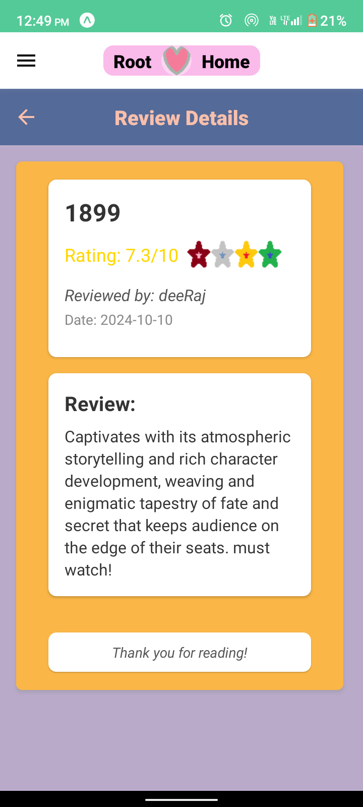

# Movie/Web Series Review App

A **React Native** application that allows users to add reviews of movies or web series. Users can input the movie name, type (movie or web series), rating (numerical), and reviewer name, along with the review details. This project helps users share their feedback and opinions about different movies and series.

## Table of Contents

- [Features](#features)
- [Installation](#installation)
- [Usage](#usage)
- [Screenshots](#screenshots)
- [Technologies Used](#technologies-used)
- [Project Structure](#project-structure)
- [Contributing](#contributing)
- [Contact](#contact)

## Features

- Add reviews for movies or web series.
- Input fields for:
  - Movie/Web Series Name
  - Type (Movie or Web Series)
  - Rating (out of 5 or 10)
  - Reviewer’s Name
  - Review Description
- Validation of input fields using Yup..
- View a list of submitted reviews.
- Simple and intuitive user interface.

## Installation

### Prerequisites

- Ensure you have [Node.js](https://nodejs.org/) and [npm](https://www.npmjs.com/) (or [yarn](https://yarnpkg.com/)) installed on your machine.
- You need [React Native CLI](https://reactnative.dev/docs/environment-setup) for development and testing on your local environment.

### Clone the Repository

```bash
git clone https://github.com/dee-raj/React-Native.git
cd movie-review-app
```

### Install Dependencies

Using npm:

```bash
npm install
```

Or using yarn:

```bash
yarn install
```

### Running the App

For Android:

```bash
npx react-native run-android
```

For iOS:

```bash
npx react-native run-ios
```

## Usage

1. Once the app is running, you will be greeted by the homepage where you can see a list of reviews if any exist.
2. To add a review, click on the "Add Review" button.
3. Fill in the details like Movie/Web Series Name, Type, Rating, Reviewer’s Name, and the Review Description.
4. Submit the review, and it will be added to the list.

## Screenshots

Include some screenshots of your app for better visualization. You can upload them in the `/screenshots` folder and reference them here.

```markdown



```

## Technologies Used

- **React Native**: Frontend development for mobile (iOS and Android).
- **JavaScript/TypeScript**: Programming language.
- **React Navigation**: For handling navigation between screens.
- **Yup**: For form validation to ensure proper input in review fields.
  
## Contributing

Contributions are welcome! To contribute:

1. Fork the repository.
2. Create a new feature branch (`git checkout -b feature/new-feature`).
3. Commit your changes (`git commit -m 'Add some feature'`).
4. Push to the branch (`git push origin feature/new-feature`).
5. Open a pull request.

## License

This project is licensed under the MIT License - see the [LICENSE](LICENSE) file for details.

## Contact

- **Name**: Dhurbaraj N. Joshi
- **Email**: [dhurbaraj343sky@gmail.com](mailto:dhurbaraj343sky@gmail.com)
- **GitHub**: [dee-raj](https://github.com/dee-raj)
